# AgentSociety Challenge — CrewAI Multi-Agent Yelp Review Predictor


> **Track:** User Behavior Simulation (Track 1) | **Framework:** CrewAI + NVIDIA NIM (MiniMax M2.7)

---

## What This Project Does

Given a Yelp **user ID** and a **business ID**, this system predicts:
1. The **star rating** (1–5) the user would give to that business
2. The **review text** the user would write — matching their real writing voice

The system uses a **multi-agent CrewAI pipeline** where specialized AI agents collaborate to analyze the user's review history, evaluate the business, and synthesize a calibrated prediction.

---

## Architecture

```mermaid
flowchart TD
    A(["run_test.py / run_pipeline.py"]) --> B
    B["Simulator\n(websocietysimulator)\nexposes: get_user · get_item · get_reviews"] --> C
    C["CrewAISimulationAgent.workflow()\ncore adapter"]

    C --> PF

    subgraph PF ["① PRE-FETCH   —   Python · zero LLM cost"]
        PF1["get_user()  →  user profile"]
        PF2["get_item()  →  business details"]
        PF3["get_reviews()  →  user's past reviews  (up to 12)"]
        PF4["get_reviews()  →  peer reviews of business  (up to 5)"]
    end

    PF --> DE

    subgraph DE ["② DATA ENRICHMENT   —   Python · zero LLM cost"]
        DE1["USER_HISTORICAL_AVERAGE_STARS  ·  USER_MODAL_STARS"]
        DE2["USER_RATING_VARIANCE  ·  USER_TYPICAL_WORD_COUNT"]
        DE3["USER_CATEGORY_SPECIFIC_AVERAGE  ·  PEER_AVG_STARS"]
        DE4["PRIOR_STAR_ESTIMATE  (adaptive blend formula)"]
    end

    DE --> CE

    subgraph CE ["③ CREW EXECUTION   —   LLM calls (~3–10 per task)"]
        CE1["Sequential:    user_profiler → item_analyst → prediction_modeler"]
        CE2["Hierarchical:  manager → user_profiler → item_analyst → calibrator → prediction_modeler"]
        CE3["Parallel:      user_profiler + item_analyst  concurrent  → prediction_modeler"]
    end

    CE --> PP

    subgraph PP ["④ POST-PROCESSING   —   Python · zero LLM cost"]
        PP1["_snap_star_bucket()  →  force output to {1.0, 2.0, 3.0, 4.0, 5.0}"]
        PP2["_is_star_sentiment_conflict()  →  retry if stars contradict review tone"]
    end

    PP --> OUT(["Output:  { &quot;stars&quot;: float,  &quot;review&quot;: str }"])

    classDef io     fill:#dbeafe,stroke:#1d4ed8,color:#1e3a5f
    classDef fetch  fill:#dcfce7,stroke:#15803d,color:#14532d
    classDef enrich fill:#fef9c3,stroke:#ca8a04,color:#713f12
    classDef crew   fill:#ede9fe,stroke:#7c3aed,color:#4c1d95
    classDef post   fill:#fee2e2,stroke:#dc2626,color:#7f1d1d
    classDef out    fill:#dbeafe,stroke:#1d4ed8,color:#1e3a5f

    class A,B,C io
    class PF,PF1,PF2,PF3,PF4 fetch
    class DE,DE1,DE2,DE3,DE4 enrich
    class CE,CE1,CE2,CE3 crew
    class PP,PP1,PP2 post
    class OUT out
```



---

## Performance Results

| Metric | Score |
|--------|-------|
| **Overall Quality** | **0.847** |
| Preference Estimation (star accuracy) | 0.878 |
| Review Generation (text quality) | 0.821 |
| Errors / Timeouts | 0 |
| Tasks Completed | 41 / 41 |
| LLM Model | MiniMax M2.7 via NVIDIA NIM |
| Crew Mode | Hierarchical (best performing) |

---

## Key Technical Innovations

| Innovation | What it does | Impact |
|------------|-------------|--------|
| **Adaptive star prior blending** | Weights user vs. item avg based on user's review count (≥50/15/<15 reviews → different ratios) | More accurate star calibration |
| **USER_MODAL_STARS** | Injects the user's most frequent star rating (if appears ≥3 times) | Stronger predictor than mean alone |
| **USER_RATING_VARIANCE** | Standard deviation of user's history — flags consistent vs. erratic raters | Helps model gauge uncertainty |
| **USER_TYPICAL_WORD_COUNT** | Avg word count from past reviews — forces review length matching | Better review_generation score |
| **PEER_AVG_STARS** | Numeric average of other reviewers' stars for the same business | Clean business quality signal |
| **USER_CATEGORY_SPECIFIC_AVERAGE** | Avg stars user gave to similar venues (keyword matching) | Outperforms overall average |
| **Style Fingerprint (6 fields)** | TYPICAL_LENGTH, TONE, USES_EXCLAMATIONS, VOCABULARY_LEVEL, etc. | Precise voice replication |
| **Hierarchical crew + calibrator** | Extra agent computes expected star range before final prediction | Reduces regression-to-mean |
| **Sentiment consistency check** | Retries if 5★ review sounds negative or 1★ review sounds positive | Eliminates contradictory outputs |
| **11 concrete review rules** | Explicit prompt rules: no generic filler, match word count, use business details | Higher review specificity |

---

## Project Structure

```
AgentSocietyChallenge_w_CrewAI-main/
│
├── crewai_simulation_agent.py    # CORE: data pre-fetch, star prior, post-processing
├── run_pipeline.py               # Development benchmarking (41 local tasks, not graded)
├── run_test.py                   # Official graded submission (35 tasks)
│
├── config/
│   ├── agents.yaml               # 5 agent role definitions
│   ├── tasks.yaml                # Task prompts (sequential + parallel)
│   ├── tasks_hierarchical.yaml   # Task prompts (hierarchical — adds calibrate_user_task)
│   └── tasks_collaborative.yaml  # Task prompt (collaborative — single hub task)
│
├── src/
│   ├── crews/
│   │   ├── simulation_crew.py    # Sequential: 3 agents, 3 tasks, ~3 LLM calls
│   │   ├── hierarchical_crew.py  # Hierarchical: 4 agents + manager, 4 tasks, ~8-10 calls
│   │   └── collaborative_crew.py # Collaborative: hub-spoke, 1 task, ~6-12 calls
│   ├── flows/
│   │   ├── serving_flow.py       # Router: reads .env → picks correct crew
│   │   └── parallel_flow.py      # Parallel: user+item analysis run simultaneously
│   └── tools/
│       └── interaction_tool_wrapper.py  # CrewAI-compatible Yelp database wrapper
│
├── scripts/
│   └── check_compatibility.py   # Pre-flight output format checker
│
├── websocietysimulator/          # framework 
├── dummy_dataset/                # Local Yelp data for development
└── .env                          # API keys and CREWAI_PROCESS_MODE setting
```

---

## Crew Mode Comparison

| Mode | Agents | Tasks | Manager | LLM Calls | Score | Status |
|------|--------|-------|---------|-----------|-------|--------|
| Sequential | 3 workers | 3 | No | ~3 | 0.839 | Available |
| **Hierarchical** | **4 + manager** | **4** | **Yes** | **~8–10** | **0.847** | **Active** |
| Parallel | 3 workers | 3 | No | ~3 (concurrent) | 0.821 | Available |
| Collaborative | 1 hub, 3 spokes | 1 | No (hub) | ~6–12 | 0.812| Available |

Switch modes by changing `.env`:
```
CREWAI_PROCESS_MODE=hierarchical   # or: sequential, parallel, collaborative
```

---

## Setup

### Prerequisites
- Python 3.11+
- [`uv`](https://github.com/astral-sh/uv) package manager

### Installation

```powershell
# 1. Clone the repository
git clone <repo-url>
cd AgentSocietyChallenge_w_CrewAI-main

# 2. Install all dependencies
uv sync

# 3. Configure environment
copy .env.example .env   # then fill in your API keys
```

### Environment Configuration (`.env`)

```env
# LLM Provider (NVIDIA NIM)
NVIDIA_API_KEY=nvapi-your-key-here

# Fallback LLM (optional)
GROQ_API_KEY=your-groq-key

# Crew mode: sequential | hierarchical | parallel | collaborative
CREWAI_PROCESS_MODE=hierarchical

# Email (for run_test.py submission)
GMAIL_APP_PASSWORD=your-16-char-app-password
```

---

## Running

### Development — Benchmark Against Local Dataset (41 tasks)

```powershell
# Validate setup — zero API cost
$env:PYTHONUTF8=1; uv run python run_pipeline.py --mock

# Single task smoke test
$env:PYTHONUTF8=1; uv run python run_pipeline.py --tasks 1

# Full benchmark — real LLM (recommended: threads 1 to avoid rate limits)
$env:PYTHONUTF8=1; uv run python run_pipeline.py --threads 1 --timeout 300
```


## How the Star Prior Works

The system blends the user's personal rating history with the business's public average using adaptive weights based on how many reviews the user has written:

```
≥ 50 reviews:  prior = 0.55 × user_avg + 0.45 × item_avg   (trust user more)
15–49 reviews: prior = 0.45 × user_avg + 0.55 × item_avg   (balanced)
< 15 reviews:  prior = 0.30 × user_avg + 0.70 × item_avg   (trust item more)
```

This prior is then adjusted up or down by `USER_CATEGORY_SPECIFIC_AVERAGE`, `PEER_AVG_STARS`, and calibrator agent analysis before the final prediction is made.

---

## Agents

| Agent | Role | Task |
|-------|------|------|
| `user_profiler` | Yelp User Behavior Analyst | Analyzes reviewer psychology, rating tendency, writing style |
| `item_analyst` | Business Intelligence Analyst | Extracts business profile, strengths, complaints |
| `calibrator` | Rating Calibration Specialist | Computes expected star range and most likely rating *(hierarchical only)* |
| `review_prediction_manager` | Program Manager | Orchestrates all agents, validates outputs *(hierarchical only)* |
| `prediction_modeler` | Prediction Strategist | Synthesizes all reports → outputs `{"stars": X, "review": "..."}` |

---

## Dependencies

| Package | Purpose |
|---------|---------|
| `crewai` | Multi-agent orchestration framework |
| `litellm` | Unified LLM API client with fallback support |
| `pydantic` | State management and data validation |
| `python-dotenv` | Environment variable loading |
| `uv` | Fast Python package manager |

---


*Built on the [WWW'25 AgentSociety Challenge](https://github.com/tsinghua-fib-lab/AgentSocietyChallenge) framework by Tsinghua University FIB Lab.*
